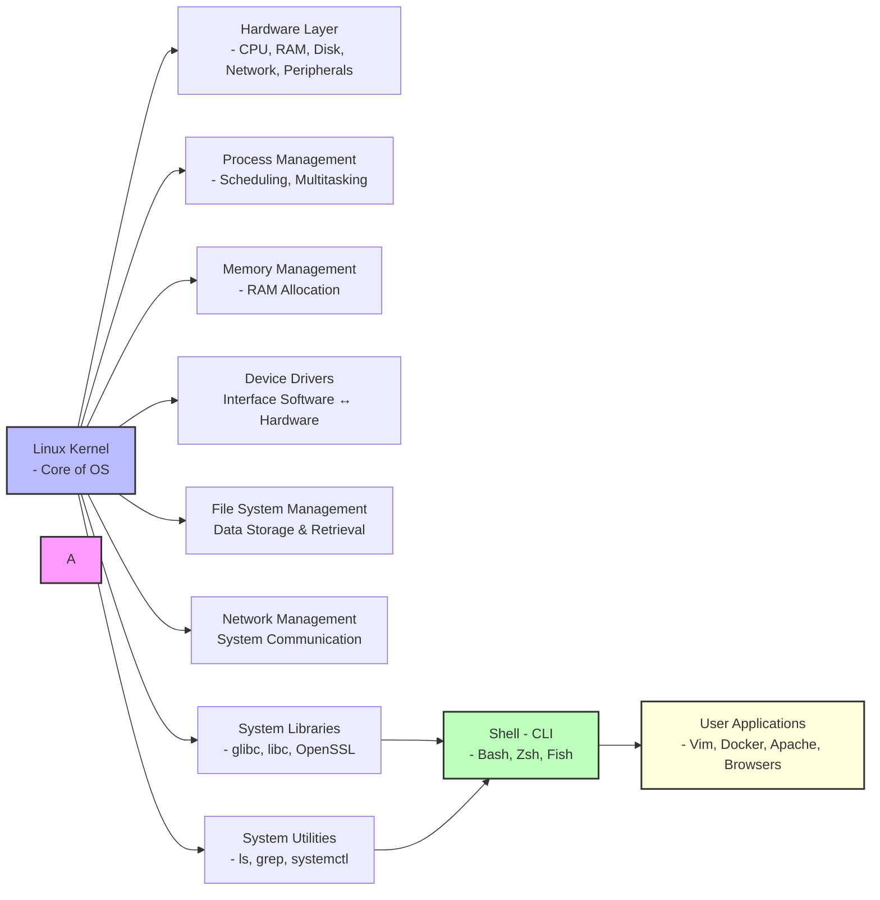

33

```mermaid
flowchart LR
    
    B[Linux Kernel<br/>- Core of OS]

B--> B0[Hardware Layer<br/>- CPU, RAM, Disk, Network, Peripherals] 
    

    B --> B1[Process Management<br/>- Scheduling, Multitasking]
    B --> B2[Memory Management<br/>- RAM Allocation]
    B --> B3[Device Drivers<br/>Interface Software ↔ Hardware]
    B --> B4[File System Management<br/>Data Storage & Retrieval]
    B --> B5[Network Management<br/>System Communication]

    B --> C[System Libraries<br/>- glibc, libc, OpenSSL]
    B --> D[System Utilities<br/>- ls, grep, systemctl]

    C --> E[Shell - CLI<br/>- Bash, Zsh, Fish]
    D --> E

    E --> F[User Applications<br/>- Vim, Docker, Apache, Browsers]

    style A fill:#f9f,stroke:#333,stroke-width:2px
    style B fill:#bbf,stroke:#333,stroke-width:2px
    style E fill:#bfb,stroke:#333,stroke-width:2px
    style F fill:#ffd,stroke:#333,stroke-width:2px
```
